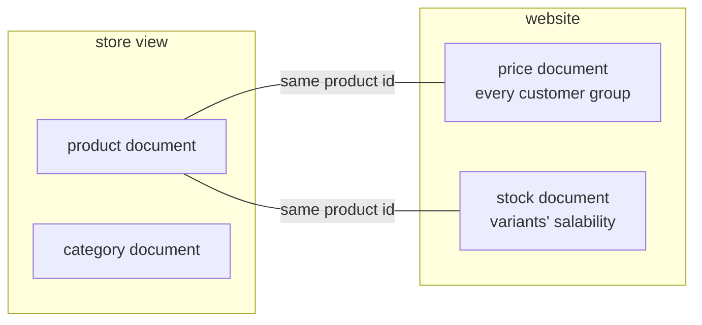
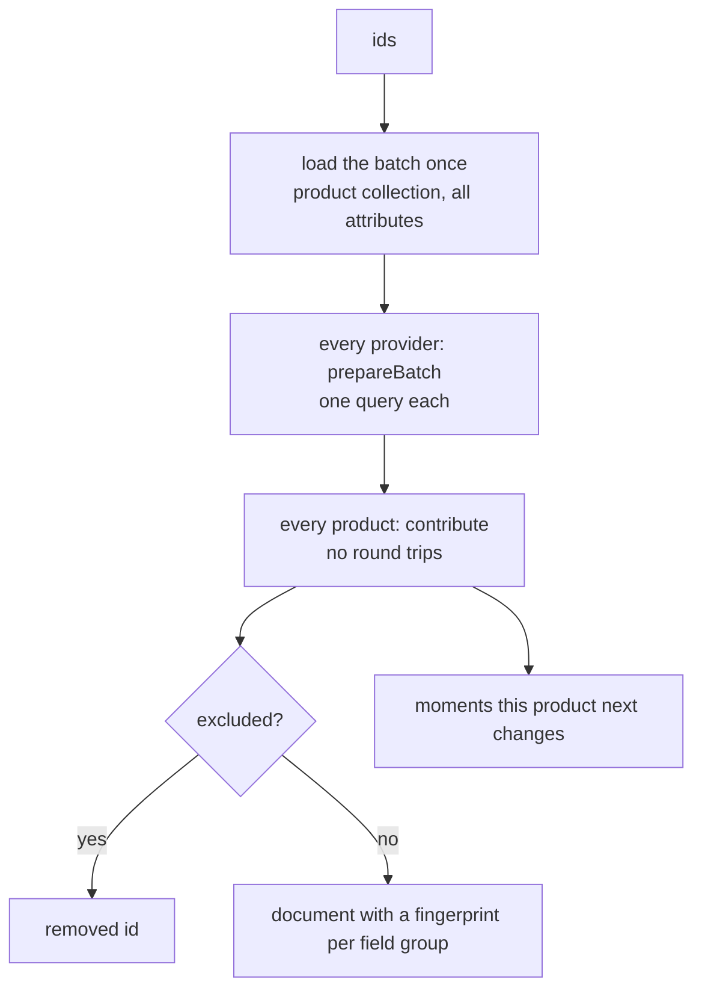
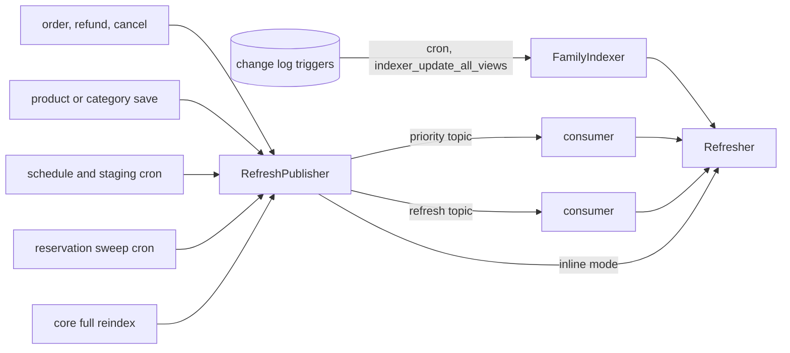
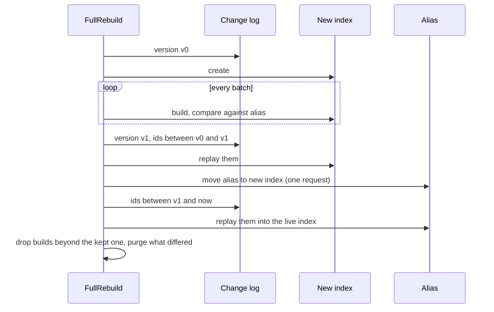
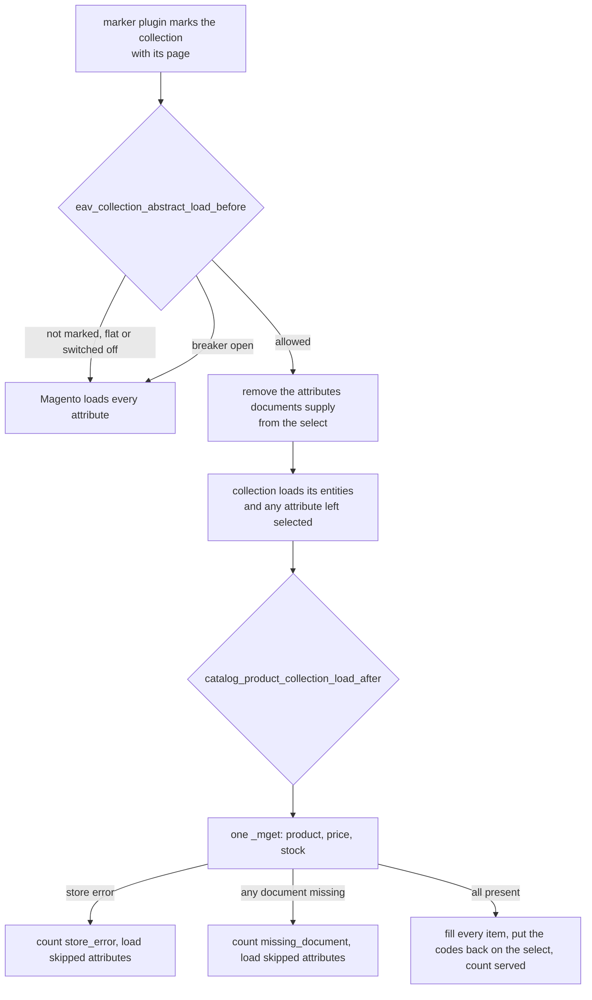

# Architecture

How the catalog index is put together, and why each piece is shaped the way it is. The README says what the module does; this says how, for someone about to change it.

## Contents

- [The rule everything follows](#the-rule-everything-follows)
- [Four families of document](#four-families-of-document)
- [Building a document](#building-a-document)
- [Keeping documents current](#keeping-documents-current)
- [Writing, versions and purges](#writing-versions-and-purges)
- [Full rebuilds](#full-rebuilds)
- [Reading on the storefront](#reading-on-the-storefront)
- [Staying honest: fallbacks, drift and status](#staying-honest-fallbacks-drift-and-status)
- [Extending it](#extending-it)

## The rule everything follows

**Documents are for display. The database decides anything that costs money.** A page may show a product as in stock a few seconds after the last unit sold; add to cart will then say so, because it checks MySQL. Every design choice below either makes documents fresher, makes a stale one cheaper to catch, or keeps a failure from reaching a shopper.

## Four families of document

| Family | Scope | Why that scope |
| --- | --- | --- |
| product | store view | Attribute values, labels and URLs differ per store view |
| category | store view | Same |
| price | website | Magento's price index is per website and customer group |
| stock | website | A stock serves a website's sales channel |

**Price and stock are separate documents** so an order or a price rule can rewrite a small document without rebuilding the product one, and so a page reads all three in one `_mget` with nothing joined at write time.

Each family has an alias, `{prefix}_{family}_{scope}`, pointing at a physical index `{alias}_{YmdHisu}`. Only lookup fields are mapped (`entity_id`, `sku`, `type_id`, `category_ids`, `is_salable`); everything else is stored in `_source` and never indexed, so a catalog with thousands of attribute codes cannot explode the mapping.

## Building a document

`ProductDocumentBuilder` loads a batch with Magento's own product collection, so store-view fallback, website assignment and, on Adobe Commerce, the current staged version are all applied the way the storefront applies them. Field providers, registered in `di.xml`, then add their part:

| Provider | Adds | Group |
| --- | --- | --- |
| Identity | id, SKU, type, visibility; excludes disabled products | listing |
| Attributes | every attribute value, split into listing and detail | listing, detail |
| Categories | category ids and positions | internal |
| URL | the product's own rewrite for the store view | listing |
| Media | the gallery, labels and positions for the store view | detail |
| Tier prices | tiers in the shape the tier price backend loads | detail |
| Variants | a configurable's super attributes, option rows and variant data | listing |
| Reviews | rating summary and count, zeros when there are none | listing |
| Custom options | whether any exist | internal |
| Schedule | when a dated value next starts or ends | not stored |

**The field group is what a change means.** `listing` and `detail` are rendered; `internal` is not. A document whose only change is `updated_at` is rewritten but purges nothing.

**Every provider loads its batch in `prepareBatch` and never queries in `contribute`.** The performance suite holds the whole build to the same number of queries for one product as for two hundred.

**The link field is always resolved through `MetadataPool`.** Attribute, gallery, tier price and super link tables join on `row_id` where content staging is installed and on `entity_id` where it is not.

## Keeping documents current

There are several ways in because no single one sees every change:

| Path | Catches | Misses |
| --- | --- | --- |
| Change log triggers | Any write to a subscribed table, including imports and direct SQL | Reservations, scheduled versions becoming active, core full reindexes that swap tables |
| Save and order observers | Admin saves, orders, refunds, cancellations, within seconds | Imports and direct SQL |
| Reservation sweep | Reservations placed by any path, including REST and imports | Nothing it is responsible for |
| Schedule runner | Special price and news dates, staged versions starting or ending | Nothing it is responsible for |
| Core reindex follower | `indexer:reindex` of Magento's price or stock index | |
| Hourly drift check | Anything the others missed, in a sample | Anything outside the sample until a later hour |

**A changed child rebuilds its parent.** A configurable's product and stock documents embed its variants, so refreshers widen every id set to its parents first.

**Nothing raised during checkout runs in that request.** Even in inline mode, order-driven refreshes are queued.

## Writing, versions and purges

`DocumentWriter` does three things for every batch:

1. **Reads the current fingerprints and categories** for the batch from the index it compares against, in one request.
2. **Writes with `version_type=external_gte`**, using a version taken from the clock before the data was read. OpenSearch refuses anything older than what it holds, and the writer treats that refusal as "someone newer already wrote this", not as an error.
3. **Deletes removed documents** with the same version, then reports a `ChangeSet`: created, deleted, which field groups changed, which categories the product joined or left.

`PurgePlanner` turns a `ChangeSet` into tags, and `TagPurger` sends them in chunks through `clean_cache_by_tags` and the application cache. The tag rules are in the README under *Only what a shopper would see change is purged*.

**Purges run one at a time.** `TagPurger` takes a lock every server shares, using foundation's `LockRunner` over Magento's lock manager, and waits up to five seconds for it. A purge that cannot get the lock parks its tags as rows in `kingletas_catalog_index_parked_purge`. Whoever holds the lock next purges the parked rows after its own tags, and a job every minute does the same when nothing else is purging. Rows are released by id, so a tag parked while a flush is running is never deleted by that flush.

**Every OpenSearch request goes through Magento's own client.** `ClientGateway` builds `Magento\OpenSearch\Model\SearchClient` from the connection settings and calls the `opensearch-php` client it wraps, passing a per-request timeout: the page read timeout for reads, the write timeout for everything else. Any failure becomes a `DocumentStoreException`; a 404 is only tolerated where missing is a real answer, such as an alias that does not exist yet.

## Full rebuilds

The mview cron keeps writing to the old index while the build runs, which is why the change log is replayed twice: once before the alias moves, for everything so far, and once after, for the seconds in between. A lock per alias stops two rebuilds of the same index. A failure before the alias moves drops the half-built index and leaves the live one alone.

Purges during a rebuild compare the new documents with the ones they replace, so a nightly rebuild that finds nothing different leaves the cache untouched. The behaviour suite holds both of those.

## Reading on the storefront

**Listings are marked, not detected.** A collection reads documents only if a marker put it there: the layer's collection filter for category and search lists, `setPositionOrder` on link collections, the CMS widget's `createCollection`, or a GraphQL collection processor. Cart items, checkout, admin grids and imports never pass through a marker, so they never read a document. Marks live in a `WeakMap` on a shared `PageScope`, not on the collection.

**No around plugin sits on the read path.** Before a marked collection loads, an observer on `eav_collection_abstract_load_before` asks `DocumentAttributeCodes` which of its selected attributes a document stores, and removes only those with `removeAttributeToSelect()`. The entity query still runs, so price, sort, pagination, filters and catalog permissions come from Magento, and any attribute a document does not store, such as one a third-party module added, is still loaded by Magento. An observer on `catalog_product_collection_load_after` puts the codes back and fills the items. If documents cannot be used it calls `_loadAttributes()` and `addMediaGalleryData()` itself, so the page ends up exactly as Magento would have loaded it.

**Product and category pages are scoped to their own entity.** `catalog_controller_product_init_before`, and `controller_action_predispatch_catalog_category_view` for categories, record the id the page is loading; `catalog_controller_product_init_after` and `catalog_controller_category_init_after` clear it. The entity manager still loads the entity row. `ProductAttributeReader` and `CategoryAttributeReader`, registered in the `AttributePool` for the storefront area, supply attribute values from the document only for that id and never in edit mode, and hand every other load to Magento's own EAV read handler. `ServedProductExtension` skips the gallery and custom option reads for a served product. The repository, its instance cache and every plugin on it run as they always do.

**Hydration never overwrites what the entity query loaded.** Indexed prices from the collection's own join stay as they are.

## Staying honest: fallbacks, drift and status

| Signal | Where it lives | When it speaks |
| --- | --- | --- |
| Fallbacks per page and reason | Application cache, hourly buckets | `status`, marked over budget above the configured share |
| Circuit breaker | Application cache | Opens after repeated failures, closes after the cooldown |
| Drift | Hourly sample | Logs a warning above the configured share, again only if it doubles or six hours pass |
| Backlog | Change log version against the view's processed version | `status` |
| Build | State table | `status` |

Nothing here writes to the database on a page view.

## Extending it

**Add a field to product documents** by writing a class implementing `FieldProviderInterface` (extend `AbstractFieldProvider` if it needs no batch state) and adding it to the `providers` argument of `ProductDocumentBuilder` in `di.xml`. Load everything in `prepareBatch`, set fields with the group that matches what a change should purge, and add it to `BuildCostTest` so the budget covers it.

**Serve a new page type** by adding a case to `PageType`, a switch to `system.xml` and `config.xml`, a method to `Config` and a line in `ReadGate`, and a marker that calls `PageScope::mark()` on the collection the page loads. Markers are `before` or `after` plugins or collection processors; they never wrap the call.

**Use another stock source** by implementing `StockReaderInterface` and putting it first in `StockReaderPool`'s `readers`.
